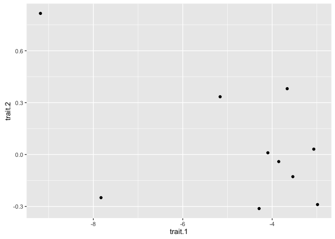
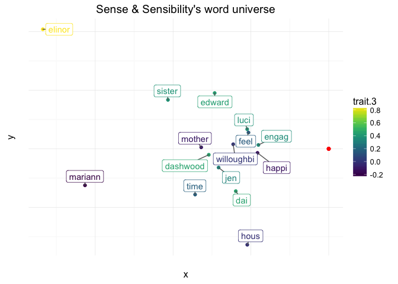
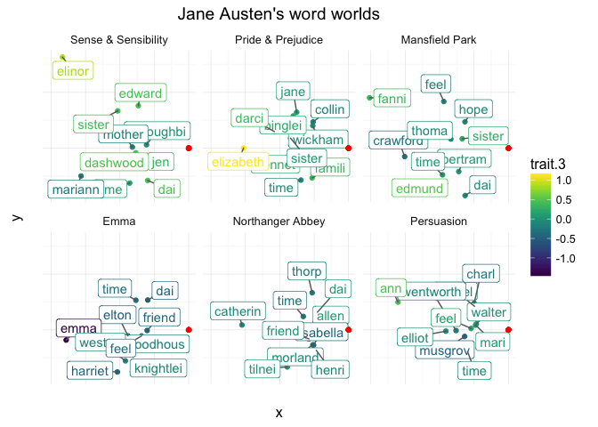
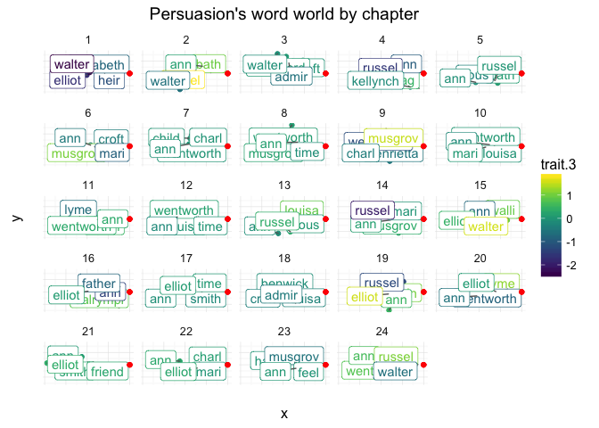

# Jane Austen's word world
Giulio V. Dalla Riva  

# Sense and Pragma


Words are important, and it is important how we use them. The Italian-speaking reader can refer to [Nanni Moretti](https://www.youtube.com/watch?v=qtP3FWRo6Ow), the others have to take my word for granted. In particular, when we choose to use a certain word together with other words to form a phrase, we are contributing to define the meaning of all those words. And, by contrast, of all the words _not_ in that phrase.

# Preliminaries

I built heavily on Julia Silge [vignette](http://juliasilge.com/blog/Life-Changing-Magic/) on the wonderful package `tidytext` and I owe much to [Andrew MacDonald](https://twitter.com/polesasunder) wise use of `tidyr` and `purrr`.

We'll need a the usual standard libraries to work in the _tidy-verse_.


```r
library(magrittr)
library(janeaustenr)
library(tidytext)
library(dplyr)
library(stringr)
library(tidyr)
library(widyr)
library(purrr)
library(ggplot2)
```

# Gather corpus

## Collecting the novels

We get all the novels from Jane Austen, as provided by Julia Silge wonderfully cute library `janeaustenr`, and we group them by `book`.


```r
corpus_austen <- austen_books() %>%
  group_by(book)
```

Following Silge's vignette, we subdivide each novel by chapter thanks to their heading: `stringr::str_detect()` allows us to detect a regular expression in the text.


```r
corpus_austen %<>%
  mutate(chapter = text %>%
           str_detect(regex("^chapter [\\divxlc]",
                            ignore_case = T)) %>%
           cumsum())
```

We finalize the collection of the corpus collapsing all the text lines of each chapter in a coherent string array.


```r
corpus_austen %<>%
  group_by(chapter, add = T) %>%
  summarise(chapter_full_text = str_c(text,collapse = " "))
```

## Cleaning the text

We clean the collapsed chapters using an ad hoc function, `vaniller()`, that can be found in `R/functions.R` (see there for more details).


```r
source("../R/functions.R")
```

Underneath `vaniller()` there is a series of call to `stringr` functions matching certain regular expressions and removing them from the collapsed text: these include fancy characters, all those _ms._ and _mr._ that will create confusion when dividing the text into phrases, chapter headings and so on. Cleaning a text, I am discovering, is an art more than a science: `vaniller()` is still work in progress, and it is heavily depending on the language (English) of the corpus, the style of the writer, and so forth.


```r
corpus_austen %<>%
  mutate(chapter_full_text = chapter_full_text %>% vaniller()) %>%
  ungroup()
```

# Compute cooccurences

The next series of steps builds the networks of word-word cooccurrences in the books phrase. For each pair of words in a _narrative unit_---e.g., books or book chapters---we count how many phrases contain both the words. The product of this process can be expressed as a square matrix: each word in a Jane Austen's narrative unit is represented as a row and a column; the matrix entry _ij_ is an integer counting the number of cooccurrances of words _i_ and _j_, eventually 0 if _i_ and _j_ never occurred together.

In this vignette, we adopt two narrative units: books and chapters. Accordingly we group our data frame by `book` or by `book` and `chapter`:


```r
word_cooccurences_book <- corpus_austen %>%
  select(-chapter) %>%
  group_by(book)

word_cooccurences_chapter <- corpus_austen %>%
  group_by(book,chapter)
```

We focus on the first case, where the narrative units are books. The second case is essentiall the same. First of all, we split the chapters in phrases and produce a nested data frame. To form the phrase, we split the text each time we find a "?", ".", ";", or "!". Are we forgetting anything?

We use `dplyr::do()` to call `stringr::str_split()` on each chapter text, `dplyr::mutate()` adds an index to the phrases (which will be handy to perform the wording) and, following Andrew suggestion, we keep everything together creating a nested data frame with `tidyr::nest()`.


```r
word_cooccurences_book %<>%
  phraser("chapter_full_text")

word_cooccurences_book
```

```
## # A tibble: 44,703 x 3
##                   book sentence_number             data
##                 <fctr>           <int>           <list>
## 1  Sense & Sensibility               1 <tibble [1 x 1]>
## 2  Sense & Sensibility               2 <tibble [1 x 1]>
## 3  Sense & Sensibility               3 <tibble [1 x 1]>
## 4  Sense & Sensibility               4 <tibble [1 x 1]>
## 5  Sense & Sensibility               5 <tibble [1 x 1]>
## 6  Sense & Sensibility               6 <tibble [1 x 1]>
## 7  Sense & Sensibility               7 <tibble [1 x 1]>
## 8  Sense & Sensibility               8 <tibble [1 x 1]>
## 9  Sense & Sensibility               9 <tibble [1 x 1]>
## 10 Sense & Sensibility              10 <tibble [1 x 1]>
## # ... with 44,693 more rows
```

Well, that looks like a strange data frame, what are those tibbles?. Let's see what's in `$data`:


```r
word_cooccurences_book %>%
  filter(book %in% "Sense & Sensibility") %>%
  select(data) %>%
  unnest()
```

```
## # A tibble: 6,846 x 1
##                                                                       sentence
##                                                                          <chr>
## 1                                 sense and sensibility  by jane austen   1811
## 2                       the family of dashwood had long been settled in sussex
## 3    their estate was large  and their residence was at norland park  in the c
## 4    the late owner of this estate was a single man  who lived to a very advan
## 5    but her death  which happened ten years before his own  produced a great 
## 6   for to supply her loss  he invited and received into his house the family 
## 7    in the society of his nephew and niece  and their children  the old gentl
## 8                                         his attachment to them all increased
## 9    the constant attention of  and  henry dashwood to his wishes  which proce
## 10        and the cheerfulness of the children added a relish to his existence
## # ... with 6,836 more rows
```

That's our _Sense & Sensibility_, split by phrase. Wonderful! Now let's further split our phrases into single words. The two step was necessary because we need to keep track of the phrase those words come from.


```r
word_cooccurences_book %<>%
  wordr()

word_cooccurences_book %>%
  filter(book %in% "Sense & Sensibility") %>%
  select(data) %>%
  unnest()
```

```
## # A tibble: 119,276 x 2
##    sentence_number split_word
##              <int>      <chr>
## 1                1       sens
## 2                1        and
## 3                1    sensibl
## 4                1         by
## 5                1       jane
## 6                1     austen
## 7                1       1811
## 8                2        the
## 9                2     famili
## 10               2         of
## # ... with 119,266 more rows
```

And finally we use `widyr::pairwise_count()` to count pair of words within phrases, grouped by book.


```r
word_cooccurences_book %<>%
  cooccurrence_counter()

word_cooccurences_book
```

```
## # A tibble: 6 x 2
##                  book                   pw_n
##                <fctr>                 <list>
## 1 Sense & Sensibility <tibble [690,732 x 3]>
## 2   Pride & Prejudice <tibble [632,230 x 3]>
## 3      Mansfield Park <tibble [866,242 x 3]>
## 4                Emma <tibble [725,502 x 3]>
## 5    Northanger Abbey <tibble [551,982 x 3]>
## 6          Persuasion <tibble [527,196 x 3]>
```

Well, that's a cute little tibble, but it contains some serious long table. Let's take a look at one example:


```r
word_cooccurences_book %>%
  filter(book %in% "Emma") %>%
  unnest()
```

```
## # A tibble: 725,502 x 4
##      book item1 item2     n
##    <fctr> <chr> <chr> <dbl>
## 1    Emma   the    of  1886
## 2    Emma    of   the  1886
## 3    Emma    to   and  1719
## 4    Emma   and    to  1719
## 5    Emma   the   and  1677
## 6    Emma   and   the  1677
## 7    Emma   the    to  1597
## 8    Emma    to   the  1597
## 9    Emma    to     a  1524
## 10   Emma     a    to  1524
## # ... with 725,492 more rows
```

Not completely interesting, the first rows contains mostly articles and prepositions. We will address that later on. For the moment, let's do the same for the other choice of narrative unit, chapters. It will be sensibly faster, as the units are smaller (or that's what I think).


```r
word_cooccurences_chapter %<>%
  phraser("chapter_full_text") %>%
  wordr() %>%
  cooccurrence_counter()

word_cooccurences_chapter %>%
  filter(book %in% "Emma", chapter %in% 4) %>%
  unnest()
```

```
## # A tibble: 36,974 x 5
##      book chapter item1 item2     n
##    <fctr>   <int> <chr> <chr> <dbl>
## 1    Emma       4   and     a    41
## 2    Emma       4     a   and    41
## 3    Emma       4    of   the    39
## 4    Emma       4   the    of    39
## 5    Emma       4    to   and    37
## 6    Emma       4    of   and    37
## 7    Emma       4   and    to    37
## 8    Emma       4   and    of    37
## 9    Emma       4    be    to    36
## 10   Emma       4    to    be    36
## # ... with 36,964 more rows
```

Notice that we took a slight detour from the usual Latent Semantic Analysis, as in LSA it is the norm to code cooccurrances in a matrix with rows corresponding to words and columns to documents (or subunits of documents) in which they appear.

# Compute word traits

Now that we have this network representation of Jane Austen's novels, we can fit a Random Dot Product Graph via `traits_ww()`.


```r
word_spaces_chapters <- word_cooccurences_chapter %>%
  mutate(traits = map(pw_n, ~.x %>% traits_ww(3,"RSpectra"))) %>%
  select(-pw_n)
```

```
## 
## Attaching package: 'Matrix'
```

```
## The following object is masked from 'package:tidyr':
## 
##     expand
```

```r
word_spaces_chapters %<>%
  unnest()
```

Let's get a look at one sample:


```r
word_spaces_chapters %>%
  filter(book %in% "Sense & Sensibility", chapter %in% 1)
```

```
## # A tibble: 472 x 6
##                   book chapter label   trait.1     trait.2     trait.3
##                 <fctr>   <int> <chr>     <dbl>       <dbl>       <dbl>
## 1  Sense & Sensibility       1    of -4.868983  0.05157827 -0.12952281
## 2  Sense & Sensibility       1   the -4.473974  0.27173224 -0.02376422
## 3  Sense & Sensibility       1   and -4.599831  0.17144521 -0.07308814
## 4  Sense & Sensibility       1    to -4.352202  0.01382185 -0.82919938
## 5  Sense & Sensibility       1     a -4.024183  0.32833601 -0.15686526
## 6  Sense & Sensibility       1    wa -3.618500  0.70902820 -0.26572868
## 7  Sense & Sensibility       1    hi -3.846779  1.25290802  0.23848820
## 8  Sense & Sensibility       1    in -3.418480 -0.25512386  0.31014146
## 9  Sense & Sensibility       1   for -2.906459  0.30456374  0.62693364
## 10 Sense & Sensibility       1   had -2.602352 -0.28376499  0.26934237
## # ... with 462 more rows
```

As we saw, the most used words---or, to be precise, the first lems in terms of number of occurrances---may be not the most informative about Jane Austen novels. Thus, let us define a set of boring words (they are not _really_ boring, 'though!). `Tidytext` offers a list of stop words, which is very close to what we need. We can increase it with some _ad hoc_ words and then use `SnowballC` to stem those words.


```r
stop_words_personal <- data_frame(
  word = c("sir", "mister", "miss", "lady",
           "colonel", "captain"),
  lexicon = "personal") %>%
  bind_rows(stop_words)

stop_words_personal %<>% mutate(
  word = SnowballC::wordStem(word)
  )
```

We can use our list of boring words to show a more interesting subset of lems. A call to `dplyr::anti_join()` will return only those `label`s in `word_space_chapters` that are not `word`s in the boring list.


```r
word_spaces_chapters %>%
  filter(book %in% "Sense & Sensibility", chapter %in% 1) %>%
  anti_join(stop_words_personal, by = c("label" = "word"))
```

```
## # A tibble: 306 x 6
##                   book chapter     label     trait.1      trait.2
##                 <fctr>   <int>     <chr>       <dbl>        <dbl>
## 1  Sense & Sensibility       1   struggl -0.01573149 -0.022498142
## 2  Sense & Sensibility       1    surviv -0.02863543  0.052909086
## 3  Sense & Sensibility       1    disput -0.04250547 -0.026981857
## 4  Sense & Sensibility       1   complet -0.03676169 -0.025279833
## 5  Sense & Sensibility       1    wealth -0.06267627  0.043173796
## 6  Sense & Sensibility       1   likewis -0.06267627  0.043173796
## 7  Sense & Sensibility       1    attach -0.04467502  0.005106662
## 8  Sense & Sensibility       1 inconveni -0.04338261 -0.013109377
## 9  Sense & Sensibility       1     spare -0.04338261 -0.013109377
## 10 Sense & Sensibility       1   forbear -0.05820623 -0.034407269
## # ... with 296 more rows, and 1 more variables: trait.3 <dbl>
```

Now we are almost done: we have the position of each stem in each chapter's word world. Two stem in similar position have been used similarly by Jane Austen in that chapter.


```r
word_spaces_chapters %<>%
  mutate(magnitude = sqrt(trait.1^2 + trait.2^2 + trait.3^2))
```


```r
word_spaces_chapters %>%
  filter(book %in% "Sense & Sensibility", chapter %in% 2) %>%
  anti_join(stop_words_personal, by = c("label" = "word")) %>%
  arrange(-magnitude)
```

```
## # A tibble: 277 x 7
##                   book chapter    label    trait.1     trait.2     trait.3
##                 <fctr>   <int>    <chr>      <dbl>       <dbl>       <dbl>
## 1  Sense & Sensibility       2    pound -1.2026476  1.39471594  0.36804387
## 2  Sense & Sensibility       2     live -1.0595642  1.22566489 -0.04433067
## 3  Sense & Sensibility       2  comfort -0.8758172  1.04610949  0.72267964
## 4  Sense & Sensibility       2 thousand -0.7092943  1.20625542  0.41050737
## 5  Sense & Sensibility       2   mother -1.2673635  0.44515992  0.50171628
## 6  Sense & Sensibility       2   father -1.0996787 -0.58078409 -0.04889844
## 7  Sense & Sensibility       2 dashwood -0.8026766 -0.10018931  0.89958680
## 8  Sense & Sensibility       2  annuiti -0.6988847  0.09878052 -0.69982852
## 9  Sense & Sensibility       2    fifti -0.4940784  0.63908983  0.49927168
## 10 Sense & Sensibility       2     half -0.6826963 -0.57445102  0.17461281
## # ... with 267 more rows, and 1 more variables: magnitude <dbl>
```

And we do the same for the books as narrative units. This will take a long time (at least on my laptop). Consider sampling a subset of cooccurrances instead of them all.


```r
word_spaces_books <- word_cooccurences_book %>%
  mutate(traits = map(pw_n, ~.x %>% traits_ww(3,"RSpectra"))) %>%
  select(-pw_n) %>%
  unnest() %>%
  mutate(magnitude = sqrt(trait.1^2 + trait.2^2 + trait.3^2))
```

Let's take a look:


```r
word_spaces_books %>%
  filter(book %in% "Sense & Sensibility") %>%
  anti_join(stop_words_personal, by = c("label" = "word")) %>%
  arrange(-magnitude)
```

```
## # A tibble: 3,643 x 6
##                   book      label   trait.1     trait.2      trait.3
##                 <fctr>      <chr>     <dbl>       <dbl>        <dbl>
## 1  Sense & Sensibility     elinor -9.183221  0.81605583  0.835091581
## 2  Sense & Sensibility    mariann -7.828757 -0.24920968 -0.211431806
## 3  Sense & Sensibility     sister -5.163846  0.33415491  0.388051115
## 4  Sense & Sensibility       time -4.291841 -0.31224457  0.169781642
## 5  Sense & Sensibility     mother -4.096041  0.01025240 -0.106782273
## 6  Sense & Sensibility   dashwood -3.852648 -0.04065951  0.450777261
## 7  Sense & Sensibility     edward -3.663380  0.38081166  0.424441954
## 8  Sense & Sensibility        jen -3.537388 -0.12781754  0.321448767
## 9  Sense & Sensibility willoughbi -3.068793  0.03119969  0.007967304
## 10 Sense & Sensibility        dai -2.985589 -0.28909772  0.447348534
## # ... with 3,633 more rows, and 1 more variables: magnitude <dbl>
```

## Plot the word world

Now that we have all the data, we are ready for some visualization. Indeed, the advantage of having a low dimensional geometric representation of the complex network of the word-word cooccurances is excatly that: we can rely on the proximity of words in the trait space to elicit information.

Let's start with a basic scatter plot of the first 10 words by trait magnitude.


```r
word_spaces_books %>%
  filter(book %in% "Sense & Sensibility") %>%
  anti_join(stop_words_personal, by = c("label" = "word")) %>%
  arrange(-magnitude) %>%
  slice(seq.int(1,10)) %>%
  ggplot(aes(x = trait.1, y = trait.2)) +
  geom_point()
```

<!-- -->

Mmm, yeah, ok. Nice dots. But what do they stand for? Here comes `ggrepel`  to the help! And, as things are starting to get long, let's wrap the plotting functions in an ad hoc file (`R/plotting_foos.R`, let's give a look there if you are interested in the details).


```r
source("../R/plotting_foos.R")
```


```r
word_spaces_books %>%
   plot_traits("Sense & Sensibility", 15)
```

```
## 
## Attaching package: 'gridExtra'
```

```
## The following object is masked from 'package:dplyr':
## 
##     combine
```

<!-- -->

This looks better. We can identify some interesting information. _Elinor_ and _Marianne_---which becomes `mariann` after stemming---are two major charaters and, from the fact that their position is dissimilar, we can venture to say that the use of _Elinor_ and _Marianne_ in _Sense and Sensibility_ is dissimilar, cooccurance wise. So, are the two character dissimilar in the novel? We left the reader to judge.

Let's take an overview look at all the novels:


```r
word_spaces_books %>%
  plot_traits_allbooks(10)
```

<!-- -->

We can see many characters. Although I never read a Jane Austen novel (never happened, maybe I will after all), it seems to me that _sisters_---and family in general---, _time_ and _feelings_ are important themes for Austen.

# The word world changes

Now that we have computed the semantic spaces (_yeah, that's fancier than word worlds_) for each chapter, we can see how the use of words changes across a novel.

Let's give a look at "Persuasion" (one of the novel with less chapters):


```r
word_spaces_chapters %>%
  filter(chapter != 0) %>%
  plot_traits_allchapters("Persuasion",4)
```

<!-- -->

Walter seems to dominate the first chapters, while Russel the latters. In the second chapter a _bath_ appears, in the seventh a _child_. We could go more in the deep, but there is caveat to be made. A word's absolute position in the word world---estimated through RDPG---is not, in general, meaningful. In fact, the Singular Value Decomposition is not unique (orthogonal transformations would leave the dot products untouched, and so we can't distinguish between them). Yet, _distances_ **are** preserved. We'll see how to make use of it in the next post.
